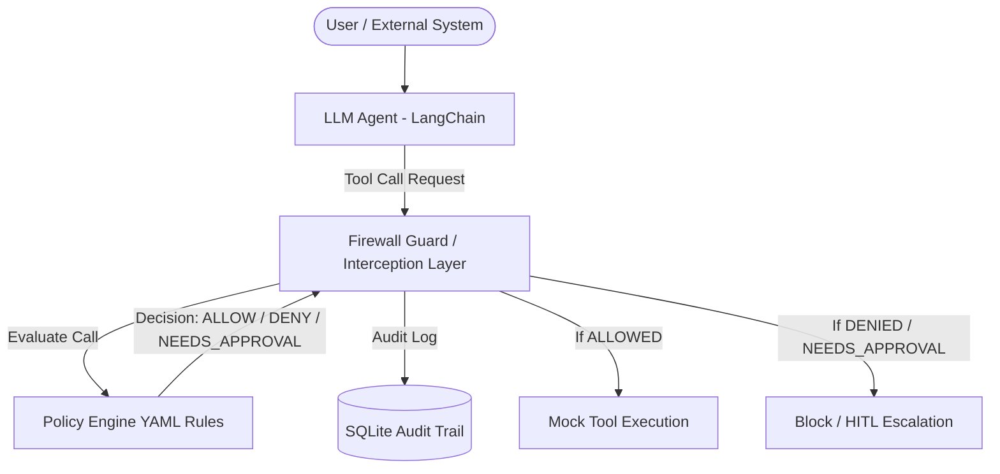

# Deterministic Action Firewall for AI Agents


<!-- TODO(verify): badge URL is a placeholder — this repo has no GitHub
     remote configured yet. Update `user/ai-agent-firewall` above to the
     real owner/repo once one exists (see LIMITATIONS.md). -->
[](https://opensource.org/licenses/MIT)
[](https://www.python.org/)

A defensive security research tool providing runtime, action-layer policy enforcement for LLM-based agents (built on LangChain). Intercepts function/tool calls before execution to enforce parameter bounds, state invariants, RBAC scoping, and anomaly detection.

> **Disclaimer**: This is a **defensive security research project**. All attack scenarios and test fixtures are executed in sandboxed local environments against mock tools (`read_file`, `send_email`, `search_web`, `transfer_funds`). No real-world targets or unauthorized external systems are accessed.

---

## Architecture Overview



---

## Directory Structure

```
/
├── firewall/             # Core firewall interception & policy engine library
├── policies/             # YAML policy definition files
├── demo_agent/           # Sample LangChain agent & mock tool definitions
├── dashboard/            # Streamlit audit & monitoring dashboard
├── tests/                # Test suite (pytest) & evaluation harness
├── docs/                 # Project documentation & Knowledge Base Vault
├── PROGRESS.md           # Phase status and execution notes
├── requirements.txt      # Project dependencies
└── README.md             # Project overview
```

---

## Quickstart Setup

1. **Clone the repository and enter directory**:
   ```bash
   cd "Project Main"
   ```

2. **Set up virtual environment**:
   ```bash
   python -m venv venv
   # On Windows PowerShell:
   .\venv\Scripts\Activate.ps1
   # On Linux/macOS:
   source venv/bin/activate
   ```

3. **Install dependencies** (runtime + dev tooling):
   ```bash
   pip install -r requirements.txt -r requirements-dev.txt
   ```

4. **Install the gitleaks binary** (needed once, for the local pre-commit
   secret-scan hook — CI runs its own copy separately and needs nothing
   installed locally):
   - Download the `v8.30.1` release for your OS from
     https://github.com/gitleaks/gitleaks/releases/tag/v8.30.1
   - Extract `gitleaks` (or `gitleaks.exe` on Windows) and put it on your `PATH`.
   - Verify: `gitleaks version` should print `8.30.1`.

5. **Install the git hooks** (run once per clone):
   ```bash
   pre-commit install
   ```

6. **Run test suite**:
   ```bash
   pytest -v
   ```

7. **Run the full local CI gate** (what `.github/workflows/ci.yml` runs):
   ```bash
   ruff check .
   black --check .
   mypy firewall/
   pytest -v
   pip-audit -r requirements.txt
   bandit -r firewall/
   ```

---

## License

This project is licensed under the MIT License - see the [LICENSE](LICENSE) file for details.
