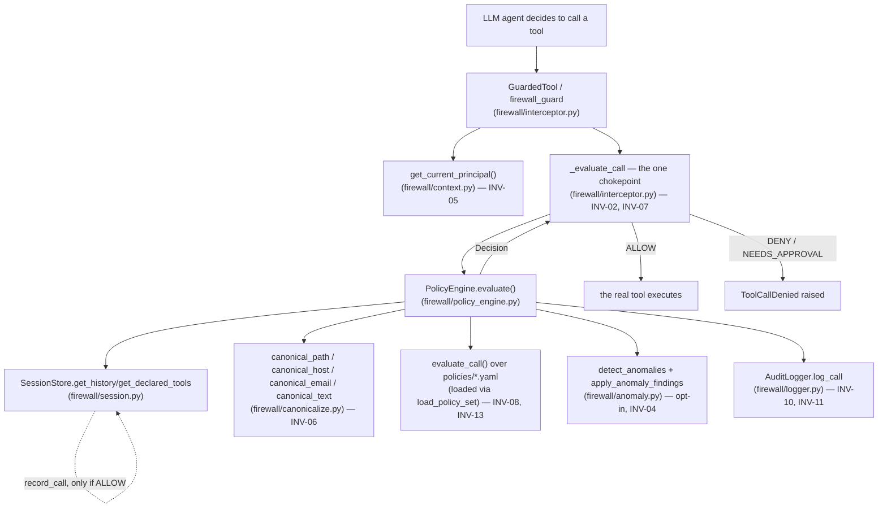

# Praetor — Architecture Map

> Maintained alongside each phase (see `PROGRESS.md`) — update this file
> when a phase adds, removes, or meaningfully changes what a file does.
> This is the fast-orientation document: what exists, what depends on
> what, and one line on what each file actually does. For *why* a design
> looks the way it does, follow the links into `docs/knowledge/` — this
> file deliberately doesn't repeat that reasoning.

## How a call actually flows

`firewall/hitl.py` (Phase 5, not yet built) will sit between a
`NEEDS_APPROVAL` `Decision` and the interceptor's allow/deny branch —
today `Decision.allowed` treats `NEEDS_APPROVAL` the same as `DENY`
(fail-closed, since nothing yet pauses for a human).

## `firewall/` — the library itself

| File | Lines | What it does | Depends on |
|---|---|---|---|
| `context.py` | 84 | `Principal` + `contextvars`-based binding (INV-05). `bind_principal`/`get_current_principal`; fail-closed `PrincipalNotBoundError` if nothing is bound. | — (no intra-package deps) |
| `interceptor.py` | 463 | The enforcement point (INV-02). `CallRecord`, `Decision`/`Outcome`, `Evaluator` protocol, `GuardedTool`/`GuardedToolRegistry` (wraps a LangChain tool at registration time), `firewall_guard` decorator, `_evaluate_call` — the single fail-closed (INV-01), TOCTOU-safe (INV-07) chokepoint every execution path funnels through. | `context.py` |
| `canonicalize.py` | 398 | INV-06: normalize-then-decide. `Canonical[T]` result wrapper; `canonical_path` (real `Path.resolve()`, UNC/NUL/percent-encoding rejection), `canonical_host` + `matches_domain_allowlist` (IDNA/punycode, label-boundary matching), `canonical_email`/`canonical_email_list` (spoofing-resistant), `canonical_text` (NFKC, zero-width/bidi stripping, single percent-decode). | — (no intra-package deps) |
| `policy_schema.py` | 202 | Pydantic v2 models for the 7 rule types (`parameter_bounds`, `path_scope`, `domain_allowlist`, `sequence`, `rbac`, `rate`, `parameter_schema`), frozen, `extra="forbid"`, `PolicySet` with unique-rule-id validation. | — (no intra-package deps) |
| `policy_engine.py` | 612 | The decision core. `load_policy_set` (INV-03: load-once, SHA-256-hashed); `evaluate_call` — pure (INV-13), conflict resolution DENY>NEEDS_APPROVAL>ALLOW>default (INV-08); INV-09 bounds + ReDoS defense (static lint + `regex` runtime timeout); `PolicyEngine` adapter wiring in session history, audit logging, and opt-in anomaly detection. | `interceptor.py`, `canonicalize.py`, `policy_schema.py`, `session.py`, `logger.py`, `anomaly.py` |
| `session.py` | 177 | `SessionStore` — real per-session call history (INV-13: injectable clock), one lock per session, TTL eviction, append-only via `record_call`. `declare_session` optionally registers a session's expected tool set (consulted by `anomaly.py`). | — (no intra-package deps) |
| `logger.py` | 391 | `AuditLogger` — SHA-256 hash-chained rows over WAL-mode SQLite (INV-10), `redact_value` secret-pattern redaction (INV-11). `verify_chain`/`ChainVerificationResult` — walks the chain, reports the first tampered row (shared by `scripts/verify_chain.py`). | `interceptor.py` (for `CallRecord`/`Decision` types) |
| `anomaly.py` | 294 | Second deterministic layer (INV-04): 4 pure detectors (call-volume spike, tool-outside-declared-set, high-risk sequence, argument-entropy jump) over `(call, session_history, declared_tools)`. `apply_anomaly_findings` folds results into an already-computed `Decision`, never downgrading it. | `interceptor.py`, `session.py` |

## `policies/` — the rules themselves (YAML, never agent-writable — INV-03)

| File | Rule type | What it does |
|---|---|---|
| `rbac.yaml` | `rbac` | Who may call which tool at all — the base grant every other allowlist rule must compose with, not bypass (ADR 0012/0014). |
| `path_scope.yaml` | `path_scope` | `read_file`/`compose_draft` file-path containment inside `sandbox/`, scoped by role. |
| `domain_allowlist.yaml` | `domain_allowlist` | `send_email`/`search_web` destination-domain allowlists, scoped by role. |
| `parameter_bounds.yaml` | `parameter_bounds` | Numeric bounds (`transfer_funds.amount`), length caps, and suspicious-content denylist patterns. |
| `parameter_schema.yaml` | `parameter_schema` | Per-tool known-parameter sets — closes INV-08's "unknown parameter → DENY" gap (ADR 0011). |
| `sequence.yaml` | `sequence` | `send_email` requires a prior `compose_draft` in the same session. |
| `rate_limits.yaml` | `rate` | Per-tool call-count caps per rolling window, all 5 tools. |

29 rules total across the 7 files. `scripts/verify_policies.py` prints a
live summary (rule count, hash, tools covered) against whatever's
currently on disk — faster than reading all 7 files by hand.

## `scripts/` — operational CLIs (never part of the decision path)

| File | What it does |
|---|---|
| `verify_policies.py` | Loads `policies/` and prints a validation summary + integrity hash (INV-03). |
| `verify_chain.py` | Thin CLI wrapper over `firewall.logger.verify_chain` — walks an audit DB, reports OK or the first tampered row, sets exit code. |
| `query_logs.py` | Read-only CLI over the audit DB — filters by session/tool/outcome/role. Safe by construction: every row was already redacted at write time. |
| `hooks/block_policy_commits.py` | Local pre-commit hook: refuses a `policies/*.yaml` commit when the `CI` env var is set (defense-in-depth for INV-03, not itself the enforcement — that's the interceptor never exposing `policies/` to agent-reachable code). |

## `tests/` — 325 passed, 1 skipped (as of 2026-09-01)

| File | Lines | Covers |
|---|---|---|
| `test_context.py` | 97 | `firewall/context.py` — INV-05 binding/isolation. |
| `test_interceptor.py` | 483 | `firewall/interceptor.py` — the INV-02 bypass-audit headline test, INV-01/INV-07 fail-closed/TOCTOU tests. |
| `test_canonicalize.py` | 407 | `firewall/canonicalize.py` — the 44-entry bypass corpus (`fixtures/bypass_corpus.yaml`) + ~25 dynamic tests. |
| `test_policy_engine.py` | 1712 | `firewall/policy_engine.py` + `policy_schema.py` — by far the largest file: schema validation, load-time failures, per-rule-type isolated tests, conflict resolution, INV-09 bounds/ReDoS, the 70-entry benign-calls corpus, a Hypothesis determinism property test, `PolicyEngine` integration (session/audit/anomaly), and the structural RBAC-composition guard. |
| `test_session.py` | 173 | `firewall/session.py` — incl. an 8-thread×200-call concurrency test. |
| `test_logger.py` | 319 | `firewall/logger.py` — hash-chain tamper detection (edited row, deleted row, first-break-only reporting), redaction end-to-end. |
| `test_anomaly.py` | 348 | `firewall/anomaly.py` — each detector in isolation, orchestration order/determinism, every fold-in case. |
| `test_offline_enforcement.py` | 47 | `conftest.py`'s INV-14 network-blocking fixture. |
| `test_scaffold.py` | 35 | Phase 0 scaffold sanity. |
| `_evaluators.py` | 81 | Test-double `Evaluator` implementations used by `test_interceptor.py` (not a real policy engine). |
| `fixtures/bypass_corpus.yaml` | — | 44 path/host/email/text bypass-attempt entries. |
| `fixtures/benign_calls.yaml` | — | 70 legitimate calls (false-positive-rate corpus for Phase 7). |

## `demo_agent/` and `dashboard/` — not yet wired to the real firewall (Phase 6 scope)

| File | Status |
|---|---|
| `demo_agent/hello_world.py` | Phase 0 smoke test — proves a LangChain tool + a mock LLM round trip works, zero firewall code involved. |
| `demo_agent/interception_demo.py` | Phase 1 demo — real `GuardedToolRegistry`, but `_DemoEvaluator` is an illustrative stand-in ("deny anything containing 'delete'"), not `PolicyEngine`. |
| `dashboard/app.py` | Streamlit shell — static placeholder metrics, not reading real audit-log data yet. |

## Where the design reasoning lives (not repeated here)

- `CLAUDE.md` — the 15 numbered invariants (INV-01..INV-15) every file
  above is cited against.
- `docs/knowledge/index.md` — Map of Content: one concept note per
  component (`action-firewall`, `interception-layer`, `canonicalization`,
  `policy-engine`, `session-state-and-audit-trail`, `anomaly-detection`),
  each with `Depends on`/`Used by`/`Key decisions`.
- `docs/knowledge/decisions/*.md` — ADRs 0003–0014, each a full
  Context/Decision/Consequences/Alternatives writeup.
- `LIMITATIONS.md` — every knowingly-unhandled case, by phase.
- `PROGRESS.md` — phase-by-phase build log with commit hashes and what
  was actually verified.
